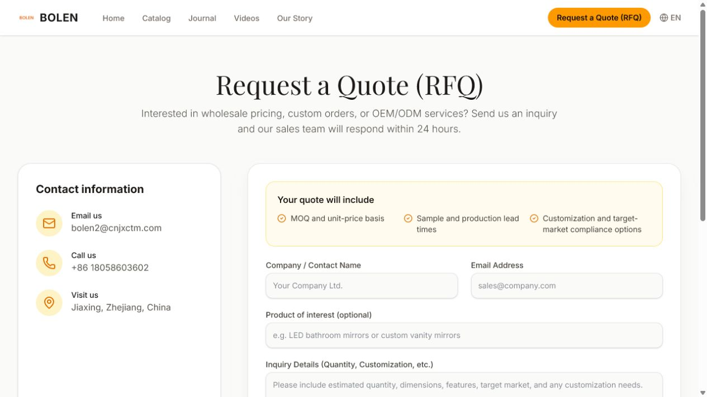
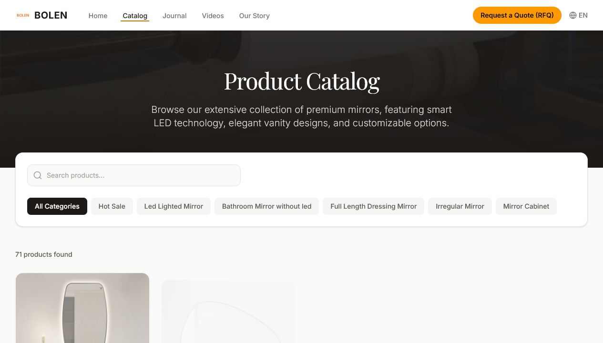
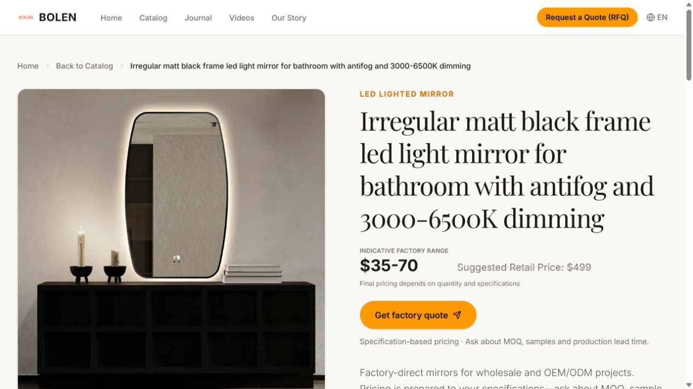
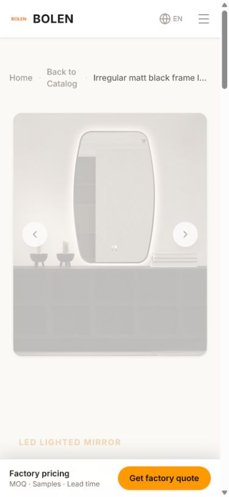
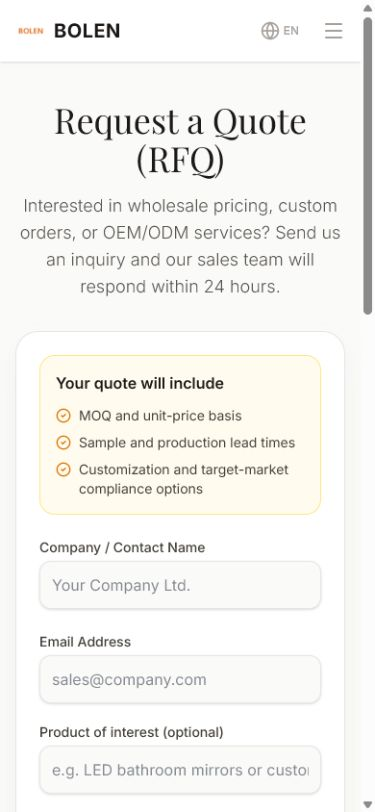

# BOLEN inquiry-conversion audit and implementation report

Date: 2026-08-11
Workspace: `D:\website-test`
Preview: `http://localhost:4173/en/`

## Scope and non-deletion guardrail

The work optimized the buyer journey without deleting or overwriting any product, Insight/blog post, video, RFQ, or media object. The four RFQs in the database were confirmed by the owner to be test submissions, so the current business baseline is **zero genuine inquiries**.

Read-only before/after checks remained unchanged:

| Content | Count |
| --- | ---: |
| Products | 71 |
| Insight/blog posts | 6 |
| Videos | 12 total / 11 published |
| RFQs | 4, all archived test records |
| Product images | 396 |
| Product videos | 57 |

## Audit steps

1. **Repository and data inventory — healthy.** Confirmed the React/Vite/Supabase stack, preserved the pre-existing dirty worktree, and fingerprinted protected database and Storage content.
2. **Conversion-path capture — completed.** Audited home, catalog, product detail, and RFQ at 1280×720 and 390×844 using the local app.
3. **Buyer-friction diagnosis — completed.** Found buried quote actions, model-only descriptions, an unbounded 71-card catalog, a mobile RFQ form below the first viewport, ambiguous price framing, contradictory trust claims, and no usable funnel events.
4. **Implementation — completed locally.** Added direct quote paths, buyer-oriented fallback copy, product/model prefill, mobile sticky CTA, form accessibility, six-language conversion copy, analytics, admin visibility, and non-deletion safeguards.
5. **Verification — passed.** TypeScript, production build, browser regression, query/prefill flow, load-more behavior, console logs, SQL parsing, and final database counts passed. No form was submitted during verification.

## Highest-impact findings and resolution

| Severity | Finding | Evidence | Resolution |
| --- | --- | --- | --- |
| Critical | Product-detail RFQ was too far from the buying decision | Desktop form top ≈2722 px; mobile ≈3521 px | Moved RFQ above specs/details/videos; final desktop ≈1180 px and mobile ≈1895 px; added first-viewport CTA and mobile sticky CTA |
| High | Catalog forced all 71 cards into one page and offered no persistent card CTA | Desktop page height ≈10,923 px | Render 12 initially, load 12 more on demand, show result count, add separate details and quote links; final page height ≈3156 px |
| High | Legacy descriptions were often only model references | 67/71 descriptions under 30 characters during audit | Preserve original model reference while presenting buyer-oriented OEM/ODM, MOQ, sample, customization, certification, and lead-time copy |
| High | RFQ page placed contact information ahead of the form on mobile | Form began around 823 px | Form now comes first on mobile; first input begins around 583 px; quote contents are stated before the fields |
| High | No measurable inquiry funnel | GA only had a base configuration | Added privacy-bounded `rfq_cta_click`, `rfq_form_start`, `generate_lead`, and `rfq_submit_error`; no name, email, message, or query string is sent in custom events |
| High | Admin could hard-delete protected content; live policies were overly broad | Products, blog, videos, profiles, settings, RFQ and Storage policy audit | Removed UI delete actions and generated a local, unapplied migration that blocks DELETE/TRUNCATE and tightens RLS and Storage writes |
| Medium | Trust claims conflicted | 1995 vs 2005; 50,000 vs 46,800 m²; blanket IP66 vs product-specific ratings | Unified visible copy to 2005 and 46,800 m²; changed certification language to product-specific IP/market requirements |
| Medium | Price ranges looked like unconditional prices | `$35-70` beside a struck retail price | Relabeled as an indicative factory range and stated that final pricing depends on quantity and specifications |

## Final visual evidence

### RFQ — desktop

### Catalog — desktop

### Product detail — desktop

### Product detail — mobile

### RFQ — mobile

### Home — mobile

## Verification evidence

- `npm run lint` — passed (`tsc --noEmit`).
- `npm run build` — passed; prerender loaded 71 products, 6 posts, and 11 published videos and generated 564 route files.
- `git diff --check` — passed.
- Browser console on the verified flow — no warnings or errors.
- Catalog search `?q=6504B` — 1 matching product; quote URL carried `product` and `model=6504B S`.
- RFQ prefill — product, model, and specification-oriented request appeared correctly; the form was not submitted.
- “Show more” — card count changed from 12 to 24.
- PostgreSQL 17.6 parser — local security migration parsed successfully; static AST scan found no row-changing DML.
- Production database — read-only counts and protected-content fingerprints remained unchanged.

## Files of interest

- Conversion UI: `src/pages/ProductDetail.tsx`, `src/pages/Products.tsx`, `src/pages/RFQ.tsx`, `src/components/ProductCard.tsx`
- Funnel analytics: `src/components/AnalyticsTracker.tsx`, `src/utils/analytics.ts`, `index.html`
- Admin non-deletion controls: `src/pages/AdminDashboard.tsx`
- Local security migration: `supabase/migrations/20260811083300_harden_content_rfq_access.sql`
- Six-language content: `src/locales/{en,zh,de,es,fr,it}.ts`

## Remaining launch risks

1. The Supabase security migration is intentionally **not applied to production**. Test it on a disposable Supabase Branch/local database with anon, pending, employee, and admin sessions before applying it.
2. In GA4, confirm Enhanced Measurement history-change page views are enabled, and configure data redaction for `q`, `product`, and `model`. Custom funnel events already omit query strings and personal data. Google recommends `generate_lead` for a successfully generated lead and prohibits PII in Analytics collection: [recommended events](https://developers.google.com/analytics/devguides/collection/ga4/reference/events), [privacy guidance](https://support.google.com/analytics/answer/6366371).
3. Production still has no verified email/CRM notification for a newly inserted RFQ. Database capture and admin visibility now work locally, but an alerting integration should be designed before relying on the form operationally.
4. Supabase RLS and grants must be tested together; public-bucket reads and staff writes should be role-tested before release: [RLS guide](https://supabase.com/docs/guides/database/postgres/row-level-security), [API security](https://supabase.com/docs/guides/api/securing-your-api), [Storage access control](https://supabase.com/docs/guides/storage/security/access-control).
